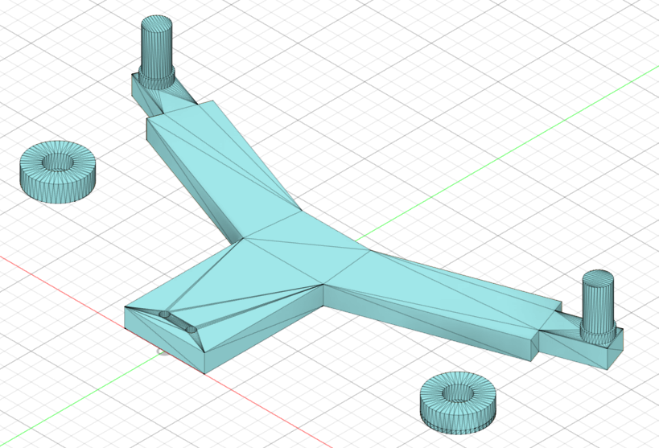

# iPBL FPV Car Project
ESP32-C3 기반 FPV RC 카의 펌웨어와 3D 모델링 자료를 포함한 프로젝트입니다.
Autodesk Fusion 360으로 제작한 모델과 BLE/ESP-NOW 통신을 이용한 제어 펌웨어를 제공합니다.

## 시뮬레이션/주행 영상 (YouTube)
아래 썸네일을 클릭하면 시뮬레이션/주행 영상을 확인할 수 있습니다.
[](https://www.youtube.com/watch?v=nZpvRqdxEcU&t)

## 프로젝트 구조
| 경로 | 설명 |
| --- | --- |
| `car_server/` | 조종기(송신) 펌웨어 (BLE 서버/ESP-NOW 송신) |
| `car_client/` | 차량(수신) 펌웨어 (BLE 클라이언트/ESP-NOW 수신) |
| `meshes/` | 3D 모델(STL) |
| `img/` | 모델/조립 이미지 |

## Firmware
ESP32-C3 + Arduino framework + PlatformIO 기준입니다.
`ESP32Servo` 라이브러리가 필요합니다.

### 통신 방식 선택
한 번에 한 가지 방식만 사용하도록 각 보드의 `src/` 폴더에서 사용할 파일만 남기고 나머지는 비활성화하세요.

- BLE 방식
  - 조종기(서버): `car_server/src/ESP32_C3_BLE_SERVER.cpp`
  - 차량(클라이언트): `car_client/src/ESP32_C3_BLE_Client.cpp`
- ESP-NOW 방식
  - 조종기(송신): `car_server/src/ESP32_C3_Transmitter_espnow.cpp`
  - 차량(수신): `car_client/src/ESP32_C3_receiver_espnow.cpp`

### 통신 데이터 형식
양쪽 모두 문자열을 사용합니다.
```
steering:<value>,speed:<value>
```
대략적인 범위는 `steering: -118 ~ 118`, `speed: -114 ~ 114` 입니다.

### 핀 맵
#### 조종기(서버)
| 기능 | 핀 |
| --- | --- |
| 조이스틱 Y (steering) | 3 |
| 조이스틱 X (미사용) | 4 |
| 전진 버튼 | 7 |
| 후진 버튼 | 2 |
| 상태 LED | 8 |

#### 차량(클라이언트)
| 기능 | 핀 |
| --- | --- |
| 서보 | 7 |
| L293D IN1/IN2 | 5 / 4 |
| 모터 PWM (EN1_2/EN3_4) | 1 / 6 |
| 상태 LED | 8 |

### ESP-NOW 사용 시 주의사항
- `car_server/src/ESP32_C3_Transmitter_espnow.cpp`에서 수신기 MAC 주소를 자신의 보드 주소로 변경하세요.
- 송수신기 모두 동일한 Wi-Fi 채널(기본 11)을 사용합니다.

### BLE 사용 시 주의사항
- 여러 장치를 한번에 사용 할 때는 uuid를 다르게 설정해줘야합니다. uuid는 인터넷에 검색해서 생성가능합니다

## 3D Modeling
STL 파일은 `meshes/`에 있습니다. Autodesk Fusion 360을 활용하여 모델링 되었으며, 버퍼를 실제 RC카 경기에서 사용하는 베어링 구조를 활용하여, 충격에 대비하였습니다.

## 이미지

> 차량 .f3d  


> 차량 .stl (DC 모터 및 servo 모터 결합부 + 기구부 + 바퀴)


> 충격시 미끄러지듯 이동가능하도록 범퍼 프레임.


> 가운데에 베어링이 들어가도록 원형 구조물 만들어서 범퍼 프레임과 연결.
